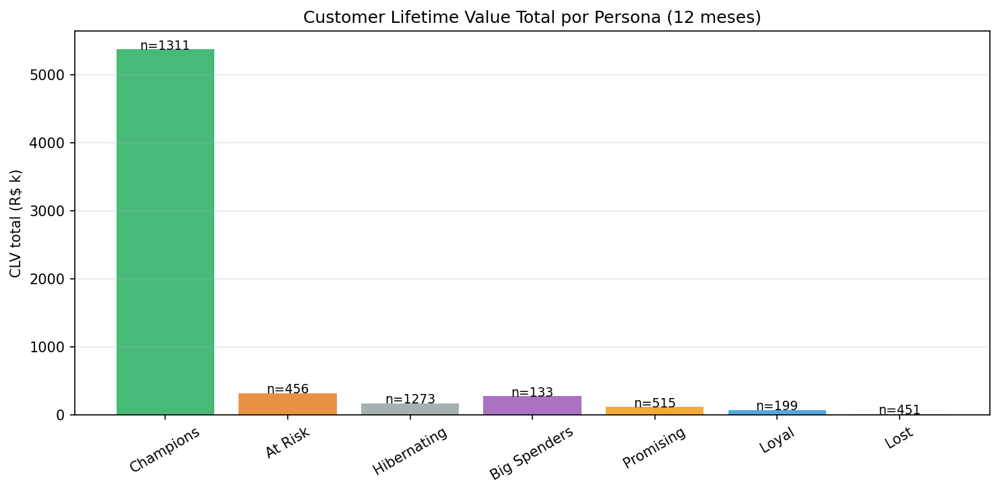
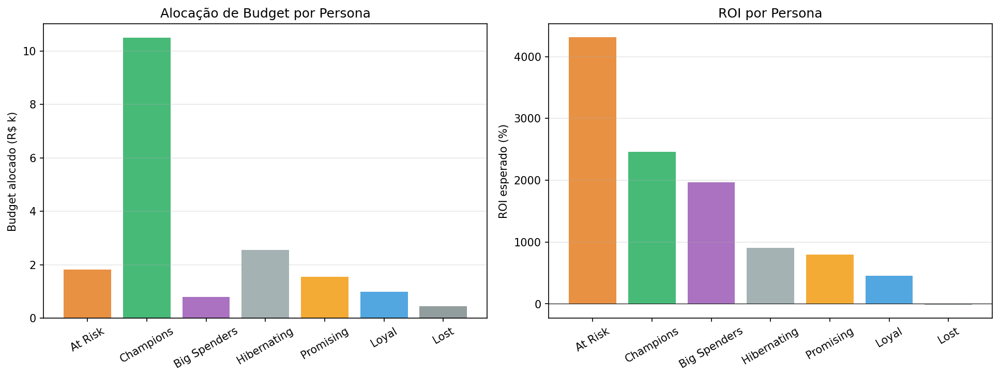

# Segmentação de Consumidores — Decisão CMO

## Sumário Executivo

- **Clientes analisados:** 4,338
- **Receita histórica:** £ 8.91M
- **CLV total esperado (12m):** £ 6.34M
- **CLV médio por cliente:** £ 1,461
- **Budget Q1:** R$ 1.000.000
- **ROI global esperado:** 2104%
- **Receita marginal esperada:** R$ 411k

---

## 1. Personas Operacionais

| Persona | n | Recency | Freq | Monetary Total | CLV Total | CLV Médio |
|---|---|---|---|---|---|---|
| Champions | 1311 | 17d | 9.4 | £ 6,487k | £ 5,373k | £ 4,098 |
| At Risk | 456 | 105d | 4.7 | £ 977k | £ 322k | £ 706 |
| Hibernating | 1273 | 171d | 1.6 | £ 789k | £ 170k | £ 134 |
| Big Spenders | 133 | 23d | 1.8 | £ 330k | £ 274k | £ 2,063 |
| Promising | 515 | 25d | 1.4 | £ 161k | £ 116k | £ 224 |
| Loyal | 199 | 21d | 3.1 | £ 92k | £ 69k | £ 346 |
| Lost | 451 | 208d | 1.0 | £ 75k | £ 13k | £ 28 |

## 2. Alocação Ótima de Budget Q1

| Persona | Custo/contato | Lift | n_alvo | Budget | Receita Marg. | ROI |
|---|---|---|---|---|---|---|
| At Risk | R$ 4.00 | 25% | 456 | R$ 2k | R$ 80k | 4312% |
| Champions | R$ 8.00 | 5% | 1311 | R$ 10k | R$ 269k | 2461% |
| Big Spenders | R$ 6.00 | 6% | 133 | R$ 1k | R$ 16k | 1963% |
| Hibernating | R$ 2.00 | 15% | 1273 | R$ 3k | R$ 26k | 905% |
| Promising | R$ 3.00 | 12% | 515 | R$ 2k | R$ 14k | 796% |
| Loyal | R$ 5.00 | 8% | 199 | R$ 1k | R$ 6k | 454% |
| Lost | R$ 1.00 | 3% | 451 | R$ 0k | R$ 0k | -16% |

**Budget alocado:** R$ 19k de R$ 1.000k
**Personas atendidas:** 7
**ROI global:** 2104%

---

## Metodologia

- **RFM**: Recency (dias), Frequency (pedidos únicos), Monetary (£ acumulado).
- **Personas**: heurística determinística sobre R/F/M-scores quartilizados.
- **CLV**: heurística BG/NBD-like — prob_ativo·exp(-Recency/90) × freq × valor médio × desconto.
- **Alocação ótima**: greedy por ROI unitário decrescente, respeitando cap por persona.